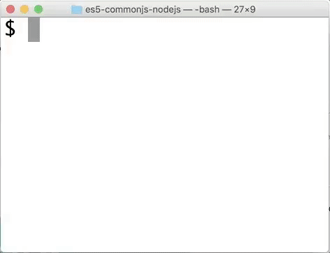

CommonJS in Node.js (ES5)
-------------------------------

## Demo

Run it : `npm start`

## Dependencies

This version uses [Moment.js](https://momentjs.com/) for date formating and [blessed](https://github.com/chjj/blessed) for console colors.
